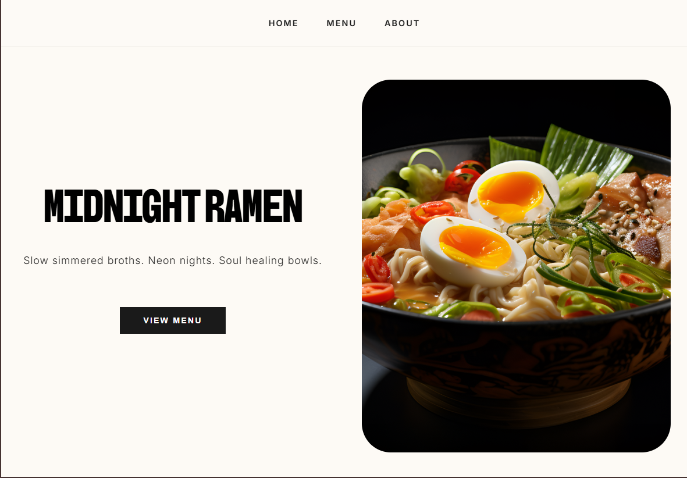
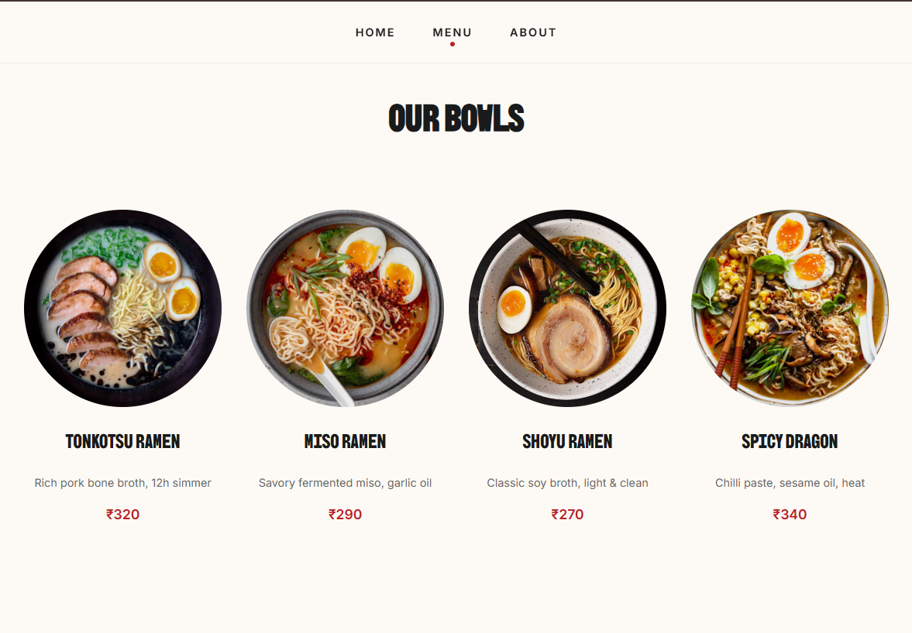
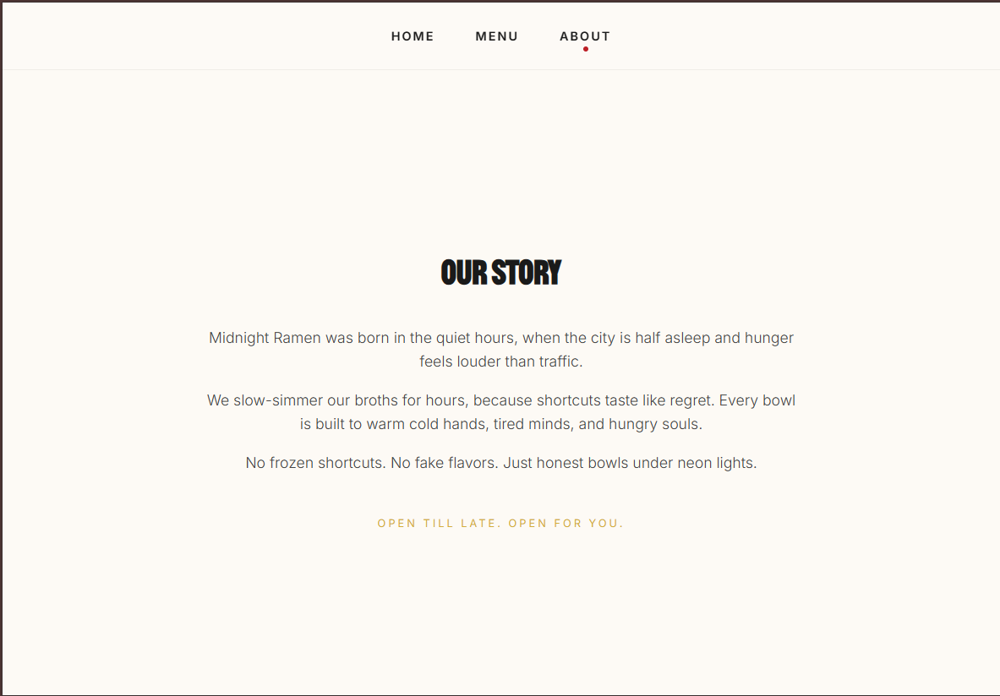

# Restaurant Page

This project showcases a strictly JavaScript-driven approach to frontend development. Instead of relying on static HTML, the entire DOM structure is generated dynamically using ES6 modules and Webpack. It implements a custom tab-switching logic that swaps content components in real-time, maintaining high performance and modular code organization.

## 🛠 Built With

- HTML
- CSS
- JavaScript
- Webpack

## 💻 Usage

    git clone https://github.com/NyxLumen/Restaurant-Page.git

    npm install

    npm run build
